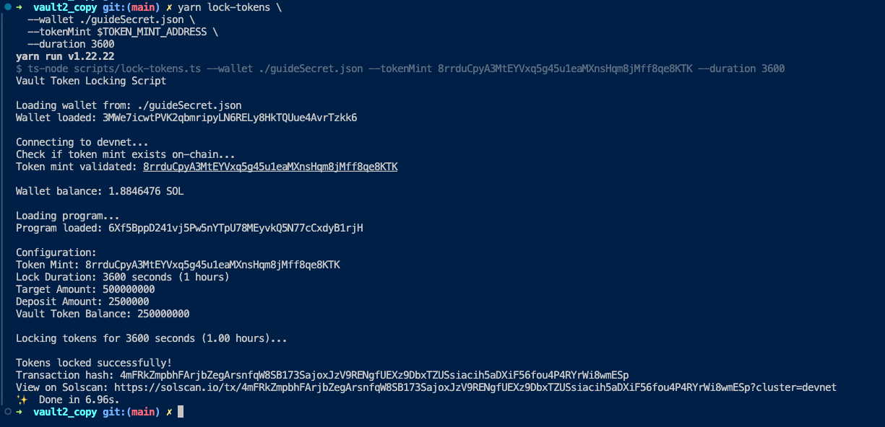

# Vault - SPL Token Vault with Locking

**Vault2** is a Solana program for creating secure **SPL token vaults** with time-based locking and automatic savings goals. Users can deposit tokens, set a target savings amount, and lock tokens for a specified duration. When the vault balance reaches the target amount, all tokens are automatically released back to the user.


## Running the Vault Script

### Prerequisites

1. **Build the program:**
   ```bash
   anchor build
   ```

2. **Deploy to devnet (if not already deployed):**
   ```bash
   anchor deploy --provider.cluster devnet
   ```

3. **Install dependencies:**
   ```bash
   npm install
   # or
   yarn install
   ```

4. **Ensure your wallet has SOL:**
   ```bash
   solana airdrop 2 --url devnet
   ```

### Running the Lock Tokens Script

**Export the following variables**
```bash
export TOKEN_MINT_ADDRESS="8rrduCpyA3MtEYVxq5g45u1eaMXnsHqm8jMff8qe8KTK" # Mint address
export LOCK_DURATION="3600" # 3600 seconds(1 hr). 
export WALLET_PATH="~/.config/solana/id.json"
export TARGET_AMOUNT="500000000" # target savings amount
export DEPOSIT_AMOUNT="250000000" # deposit amount
```

**Basic usage (lock existing tokens in vault):**
```bash
yarn lock-tokens \
  --tokenMint $YOUR_TOKEN_MINT_ADDRESS \
  --duration 3600
```

**Full usage (initialize vault, deposit, and lock):**
```bash
yarn lock-tokens \
  --tokenMint YOUR_TOKEN_MINT_ADDRESS \
  --duration 86400 \
  --target 1000000000 \
  --deposit 500000000 \
  --wallet ~/.config/solana/id.json
```

### Parameters

- `--tokenMint` (required): Your SPL token mint address
- `--duration` (required): Lock duration in seconds (e.g., 3600 = 1 hour, 86400 = 24 hours)
- `--wallet` (optional): Path to wallet keypair (defaults to `~/.config/solana/id.json`)
- `--target` (optional): Target amount for vault initialization (required for new vaults)
- `--deposit` (optional): Amount of tokens to deposit (defaults to 0)

### Examples

**Lock tokens for 1 hour:**
```bash
yarn lock-tokens --tokenMint 8rrduCpyA3MtEYVxq5g45u1eaMXnsHqm8jMff8qe8KTK --duration 3600
```

**Initialize vault and lock for 24 hours:**
```bash
yarn lock-tokens \
  --tokenMint YOUR_TOKEN_MINT \
  --duration 86400 \
  --target 1000000000 \
  --deposit 500000000
```

## Example Output

**Transaction Hash:** `4mFRkZmpbhFArjbZegArsnfqW8SB173SajoxJzV9RENgfUEXz9DbxTZUSsiacih5aDXiF56fou4P4RYrWi8wmESp`


